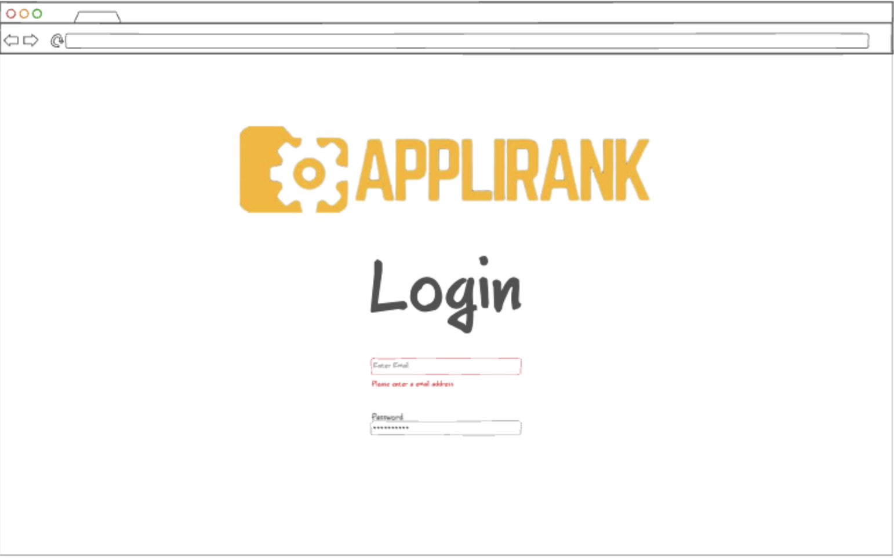
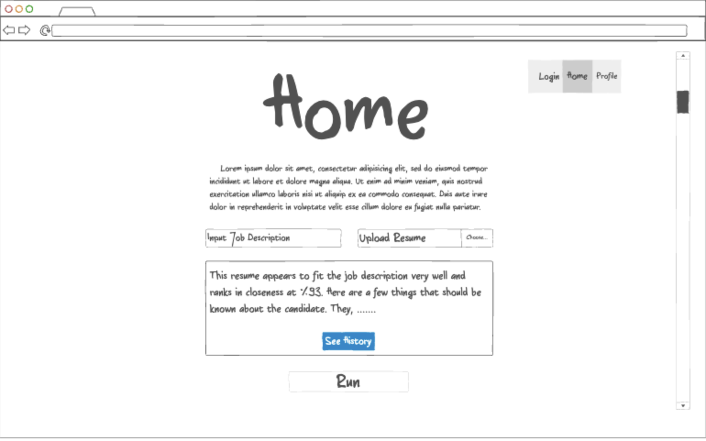
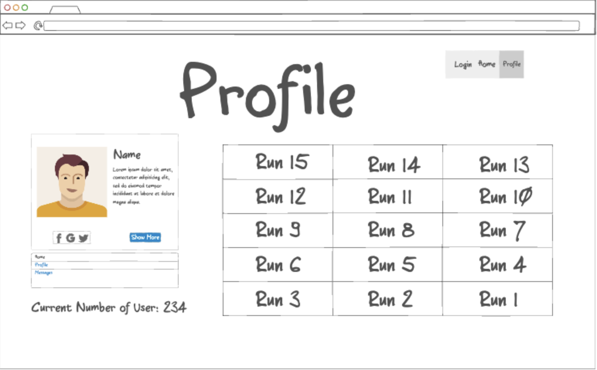
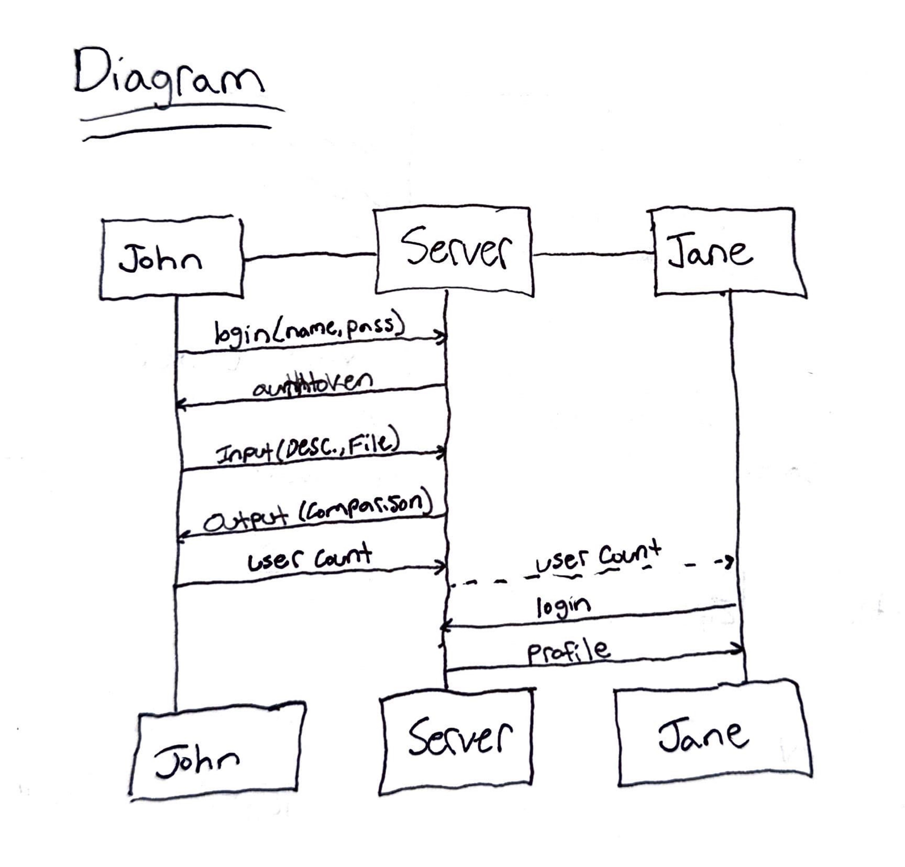

# Startup-AppliRank

## Description deliverable

### Elevator pitch

Imagine you’ve just been assigned to read a resume, but you really don’t have the time to read through the whole thing as there are hundreds of applicants for a job. What if you could upload a job description and a resume and get an AI automated score for how well the applicant would match the job? With AppliRank, an applicant is scored directly against the job description, saving you time and allowing you to focus on the best candidates first.

### Design

Here is a sequence diagram that shows how two different users might interact with the server.

### Key features

- Secure login over HTTPS
- Ability to input a job description
- Ability to input a file to be read
- Ability to run the inputs and receive a formulated response
- History of runs is shown in the user profile
- Ability for the used to read each of the past runs
- Results are persistently stored

### Technologies

I am going to use the required technologies in the following ways.

- **HTML** - Uses correct HTML structure for this application. Three HTML pages. One for login, one for user inputs, and one for a user profile.
- **CSS** - Application styling that looks good on different screen sizes, uses good whitespace, color choice, and brand colors that are consistent
- **JavaScript** - Provides login, user input, file input, display responses from external APIs, and backend endpoint calls.
- **Service** - Backend service with endpoints for:
  - login
  - retrieving output from APIs
  - submitting user inputs to APIs
  - retrieving history of user inputs and produced outputs
- **DB** - Store users, history of runs.
- **Login** - Register and log in users. Credentials are securely stored in a database. Can't see user history unless authenticated.
- **WebSocket** - As each new user is added, the total number of active accounts is shown on the website.
- **React** - Application ported to use the React web framework.

## HTML deliverable

For this deliverable, I built out the structure of my application using HTML.

- **HTML pages** - Three HTML pages that represent the ability to login, generate resume comparisons, and view your profile/history.
- **Links** - The login page automatically links to the generate page on login. All other pages have links to each page.
- **Text** - Text describes how to use the resume ranking generator and where to put files.
- **Images** - I added a logo image as well as a profile picture for the user. 
- **Login** - Input box for name and password as well as a submit button for login.
- **Database** - The history blocks that are numbered represent a history of user submissions stored in a database.
- **WebSocket** - The number of current users displayed represents information sharing amongst all users using a web socket.

## CSS deliverable

For this deliverable I properly styled the application into its final appearance.

- **Header, footer, and main content body**
- **Navigation elements** - I dropped the underlines and changed the color for anchor elements along with adding an active effect.
- **Responsive to window resizing** - My app uses bootstrap and automatically changes content position based off of window sizes and devices
- **Application elements** - Used a logo and a set color scheme to add consistency
- **Application text content** - Consistent fonts and font sizes
- **Application images** - Added image styling and rounding for profile page

## JavaScript deliverable

For this deliverable I implemented my JavaScript so that the application works for a single user. I also added placeholders for future technology.

- **login** - When you press enter or the login button it takes you to the generator/home page and stores values into local storage.
- **database** - Displays a set of fake generations in the user profile, all from JSON data. This JSON information will be stored in a DB with each user.
- **WebSocket** - I made a generateButton function that will connect with an external API to produce a message to the screen. Currently, it is showing the JSON information that will be sent in this request.
- **application logic** - The profile name and password are shown on the user profile after login.
