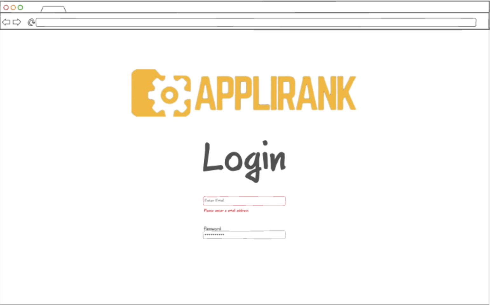
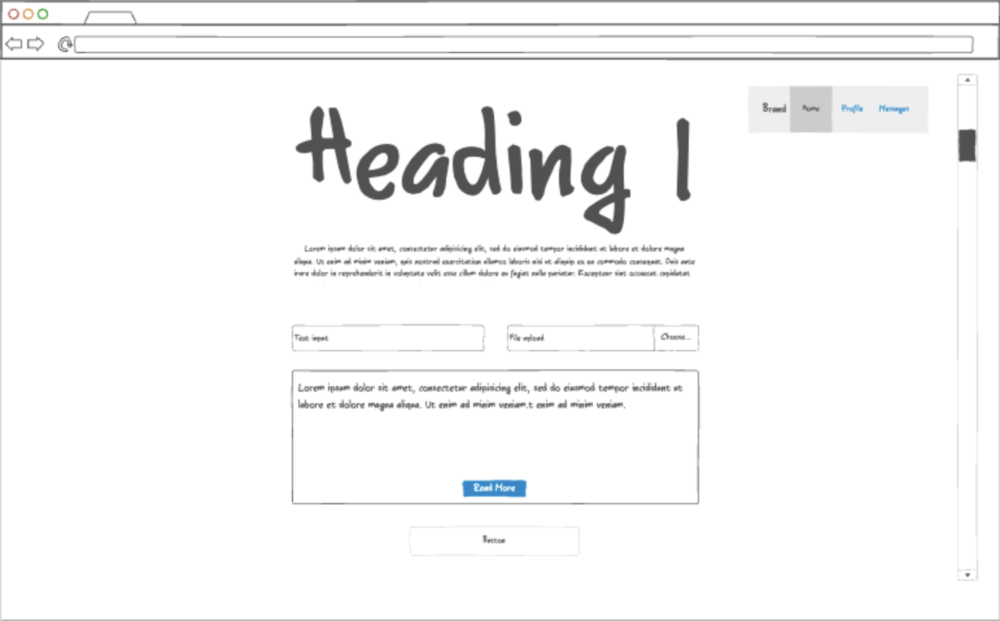

# Startup-AppliRank

## Description deliverable

### Elevator pitch

Imagine you’ve just been assigned to read a resume, but you really don’t have the time to read through the whole thing as there are hundreds of applicants for a job. What if you could upload a job description and a resume and get an AI automated score for how well the applicant would match the job? With AppliRank, an applicant is scored directly against the job description, saving you time and allowing you to focus on the best candidates first.

### Design

Here is a sequence diagram that shows how to people would interact with the backend to vote.

### Key features

- Secure login over HTTPS
- Ability to input a job description
- Ability to input a file to be read
- Ability to run the inputs and receive a formulated response
- History of runs is shown in the user profile
- Ability for the used to read each of the past runs
- Results are persistently stored

### Technologies

I am going to use the required technologies in the following ways.

- **HTML** - Uses correct HTML structure for this application. Three HTML pages. One for login, one for user inputs, and one for a user profile.
- **CSS** - Application styling that looks good on different screen sizes, uses good whitespace, color choice, and brand colors that are consistent
- **JavaScript** - Provides login, user input, file input, display responses from external APIs, and backend endpoint calls.
- **Service** - Backend service with endpoints for:
  - login
  - retrieving output from APId
  - submitting user inputs to APIs
  - retrieving history of user inputs and produced outputs
- **DB** - Store users, history of runs.
- **Login** - Register and log in users. Credentials are securely stored in a database. Can't see user history unless authenticated.
- **WebSocket** - As each new user is added, the total number of active accounts is shown on the website.
- **React** - Application ported to use the React web framework.

