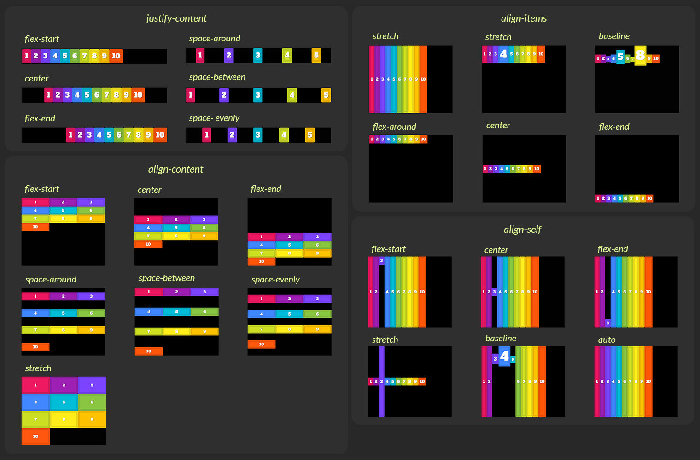
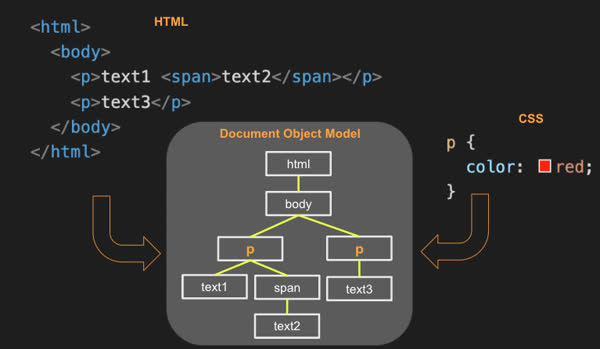

# Notes
### 9/15/23

##### I learned many things from this assignment, mainly, I learned how to commit changes push them, and pull them. It is similar to saving a backup of your work, but this also allows others to collaborate in a group-like manner.

### 9/25/23
#####  Some of the common HTML structural elements include body, header, footer, main, section aside, p, table, ol/ul, div, and span. We demonstrate the use of each element with the following HTML document. It starts with the top-level content body. The body has three children, a header, a main, and footer. Each of the body children then contains other structural content.

### 10/14/23
##### Learned how to use CSS sheets in conjunction with Bootstrap to make a design that was both clean and functional. Used various tags: header{}. p{}, and id tags including #. Bootstrap allowed me to added quality designs by bringing in the link through an href.

### MIDTERM
- In the following code, what does the link element do?
  + The ```<link>``` tag defines the relationship between the current document and an external resource.
  + The ```<link>``` tag is most often used to link to external style sheets or to add a favicon to your website.
  + The ```<link>``` element is an empty element, it contains attributes only.
  + href, media, rel(href specifies the location of the linked document)
- In the following code,  what does a div tag do?
  + The ```<div>```element defines a division or a section in an HTML document
  + The ```<div>``` tag is easily styled by using the class or id attribute.
  + Any sort of content can be put inside the ```<div>``` tag! 
- In the following code, what is the difference between the #title and .grid selector?
  + #title
  + This is an ID selector. It selects an HTML element with the id attribute set to "title."
  + It's typically used to select a specific, unique element on a webpage. There should only be one element with a given ID on a page because IDs must be unique.
  + .grid
  + This is a class selector. It selects all HTML elements that have a class attribute set to "grid."
  + It's used to select multiple elements that share a common class attribute. Multiple elements can have the same class.
- In the following code, what is the difference between padding and margin?
  + Margin: It is the space around an element. Margins are used to move an element up or down on a page as well as left or right. Margin is completely transparent, and it does not have any background color. It clears the area around the element. Each side of the element has a margin size you can change individually. In creating the gap, the margin pushes adjacent elements away.
  + Padding: It is the space between the element and the related content inside it. It determines how elements look and sit within a container. It also shows the container background around the element in it. Padding can be affected by background colors as it clears the area around the content. To create the gap, it either grows the element size or shrinks the content inside. By default, the size of the element increases.
- Given this HTML and this CSS how will the images be displayed using flex?
  + 
  + 
  + 
  + 
  + 
- What does the following padding CSS do?
  + The CSS padding properties are used to generate space around an element's content, inside of any defined borders.
- What does the following code using arrow syntax function declaration do?
  + hello = function() {
  return "Hello World!";}
  + hello = () => {
  return "Hello World!";}

- What does the following code using map with an array output?
  + map() creates a new array from calling a function for every array element.
  + map() does not execute the function for empty elements.
  + map() does not change the original array.
- What does the following code output using getElementByID and addEventListener?
  + This gets the element and change its color:
  + const myElement = document.getElementById("demo");
  myElement.style.color = "red";
  + Add a click event to a ```<button>``` element:
  + element.addEventListener("click", function() {
  document.getElementById("demo").innerHTML = "Hello World";
  });
- What does the following line of Javascript do using a # selector?
  + To select an element with a specific id, write a hash character, followed by the id of the HTML element:
- Which of the following are true? (mark all that are true about the DOM)
  + 
  + The Document Object Model (DOM) is an object representation of the HTML elements that the browser uses to render the display. The browser also exposes the DOM to external code so that you can write programs that dynamically manipulate the HTML. The browser provides access to the DOM through a global variable name document that points to the root element of the DOM. If you open the browser's debugger console window and type the variable name document you will see the DOM for the document the browser is currently rendering.
  + Every element in an HTML document implements the DOM Element interface, which is derived from the DOM Node interface. The DOM Element Interface provides the means for iterating child elements, accessing the parent element, and manipulating the element's attributes. From your JavaScript code, you can start with the document variable and walk through the every element in the tree.
  + The DOM supports the ability to insert, modify, or delete the elements in the DOM. To create a new element you first create the element on the DOM document. You then insert the new element into the DOM tree by appending it to an existing element in the tree.
  + The DOM also allows you to inject entire blocks of HTML into an element. The following code finds the first div element in the DOM and replaces all the HTML it contains.
  + All DOM elements support the ability to attach a function that gets called when an event occurs on the element. These functions are called event listeners. Here is an example of an event listener that gets called when an element gets clicked.
- By default, the HTML span element has a default CSS display property value of: 
  + inline
- How would you use CSS to change all the div elements to have a background color of red?
  + div {
  background-color: red;}
- How would you display an image with a hyperlink in HTML?
  + ```<a href="https://www.example.com" </a>```
- In the CSS box model, what is the ordering of the box layers starting at the inside and working out?
  + Content: This is the innermost layer and represents the actual content of the box, such as text, images, or other media. The content area is where the text and images are displayed.

  + Padding: The padding is the space between the content and the border. It provides additional space inside the box. You can control the padding using the padding property in CSS.

  + Border: The border is the line that surrounds the padding and content. It acts as a boundary to separate the box from its surroundings. You can set the border properties using CSS, such as border-width, border-color, and border-style.

  + Margin: The margin is the outermost layer and represents the space outside the border. It defines the space between the box and other elements on the page. You can control the margin using the margin property in CSS.
- Given the following HTML, what CSS would you use to set the text "troubl" to green and leave the "double" text unaffected?
  + ```<p>This is double troubl</p>```
  + ```<p>This is double <span class="green-text">troubl</span></p>```
  + ```.green-text {color: green;}```

- What will the following code output when executed using a for loop and console.log?
  + ```for (let i = 1; i <= 5; i++) {console.log(i);}```
  + When you run this code, you will see the numbers 1, 2, 3, 4, and 5 printed to the console, one at a time.
- How would you use JavaScript to select an element with the id of “byu” and change the text color of that element to green?
  + ```// Select the element by its id| var element = document.getElementById("byu");```
  + ```// Change the text color to green| element.style.color = "green";```
- What is the opening HTML tag for a paragraph, ordered list, unordered list, second level heading, first level heading, third level heading?
  + Paragraph: ```<p>```
  + Ordered List: ```<ol>```
  + Unordered List: ```<ul>```
  + Second-Level Heading: ```<h2>```
  + First-Level Heading: ```<h1>```
  + Third-Level Heading: ```<h3>```
- How do you declare the document type to be html?
  + ```<!DOCTYPE html>```
- What is valid javascript syntax for if, else, for, while, switch statements?
  + ```if (condition) {} else{}```
  + ```for (initialization; condition; iteration) {}```
  + ```while (condition) {)```
  + ```switch (expression){ case value1: break; case value2: default:)}```

- What is the correct syntax for creating a javascript object?
  + ```var myObject = {key1: value1, key2: value2,};```
- Is is possible to add new properties to javascript objects?
  + Yes, it is possible to add new properties to JavaScript objects, and it's one of the flexible and powerful features of JavaScript. You can add new properties to an object by simply assigning a value to a new key or property name. Here's how you can do it:
  + // Create an empty object
    var myObject = {}; 
    // Add properties to the object
    myObject.firstName = "John";
    myObject.lastName = "Doe";
    myObject.age = 30;
- If you want to include JavaScript on an HTML page, which tag do you use?
  + ```<script>```
- Given the following HTML, what JavaScript could you use to set the text "animal" to "crow" and leave the "fish" text unaffected?
  + ```<p id="animals">animal and fish</p>```
  + ```var element = document.getElementById("animals");```
  + ```element.textContent = element.textContent.replace("animal", "crow");```
- Which of the following correctly describes JSON?
  + JSON, which stands for "JavaScript Object Notation," is a lightweight data interchange format that is easy for humans to read and write and easy for machines to parse and generate. JSON is often used to transmit data between a server and a web application or between different parts of a program. It has become a common data format with widespread use in web development.
  + JSON data is represented as a collection of key-value pairs, where keys are strings enclosed in double quotes, and values can be strings, numbers, objects, arrays, booleans, or null. JSON has a syntax similar to JavaScript objects and arrays, which makes it easy to work with in JavaScript.
  + {"key":"pair"}
- What does the console command chmod, pwd, cd, ls, vim, nano, mkdir, mv, rm, man, ssh, ps, wget, sudo  do?
  + chmod: Changes the permissions of files and directories. It allows you to modify the access permissions for users (owner, group, and others) to read, write, and execute a file.
  + pwd: Prints the current working directory. It displays the full path of the directory you are currently in.
  + cd: Stands for "change directory." It is used to navigate the file system by moving into different directories. For example, "cd /myfolder" changes the current directory to "/myfolder."
  + ls: Lists the contents of a directory. It shows the files and subdirectories within the current directory.
  + vim: A text editor used in the console. It allows you to create and edit text files directly in the terminal. It can be quite powerful but has a steep learning curve.
  + nano: Another text editor for the console. It is simpler and more user-friendly than Vim, making it a good choice for beginners.
  + mkdir: Stands for "make directory." It is used to create new directories or folders.
  + mv: Stands for "move." It is used to move or rename files and directories. It can also be used for both operations simultaneously.
  + rm: Stands for "remove." It is used to delete files and directories. Be cautious when using this command, as it can permanently delete data.
  + man: Stands for "manual." It is used to display the manual pages for commands. You can use it to learn about the usage and options of other commands.
  + ssh: Stands for "Secure Shell." It is used to connect to remote servers securely. You can log in to remote servers and execute commands on them.
  + ps: Stands for "process status." It is used to list the currently running processes on the system.
  + wget: A command-line tool for downloading files from the internet. You provide a URL, and wget retrieves the file for you.
  + sudo: Stands for "superuser do." It is used to execute a command as a superuser or with elevated privileges, typically requiring a password.
- Which of the following console command creates a remote shell session?
  + The console command that creates a remote shell session is ssh, which stands for "Secure Shell." The ssh command is used to establish a secure and encrypted connection to a remote server or machine, allowing you to log in and access a shell session on that remote system. This is commonly used for remote administration, file transfer, and other tasks where secure access to a remote system is needed.
  + ./deployFiles.sh -k /Users/nicholaslewis/Downloads/260.pem -h applirank.click -s startup  
  + ssh username@remote-server.com
- Which of the following is true when the -la parameter is specified for the ls console command?
  + -l: This parameter stands for "long format." It causes the ls command to display detailed information about the files and directories in the specified directory. This includes file permissions, owner, group, file size, modification date, and file/directory name.
  + -a: This parameter stands for "all." It makes ls show all files and directories, including hidden files and directories. Hidden files and directories are those that have names starting with a dot (e.g., ".config" or ".git").
  + So, when you use ls -la, you get a long-format listing of all files and directories in the current directory, including hidden ones. This is a common way to view detailed information about all files, including those that are typically hidden from standard listings.
- Which of the following is true for the domain name banana.fruit.bozo.click, which is the top level domain, which is a subdomain, which is a root domain?
  + Top-Level Domain (TLD): "click"
    Subdomain: "banana" (a subdomain of "fruit")
    Root Domain: "click" (the highest level domain)
- Is a web certificate is necessary to use HTTPS.
  + Yes, a web certificate, specifically an SSL/TLS certificate, is necessary to use HTTPS (Hypertext Transfer Protocol Secure) on a website. An SSL/TLS certificate is essential for enabling secure, encrypted communication between a web server and a web browser.
- Can a DNS A record can point to an IP address or another A record.
  + A DNS A (Address) record is used to map a domain name to an IPv4 address. It cannot directly point to another A record. Instead, you can use a CNAME (Canonical Name) record to create an alias or reference to another domain name.
  + So, while an A record directly points to an IP address, if you want a domain name to reference another domain name, you should use a CNAME record. The CNAME record indirectly achieves the functionality of "pointing" to another domain name without specifying the IP address directly.
- Port 443, 80, 22 is reserved for which protocol?
  + Port 443: Reserved for HTTPS, providing secure web browsing with SSL/TLS encryption.
  + Port 80: Reserved for HTTP, used for regular, unencrypted web browsing.
  + Port 22: Reserved for SSH, a protocol for secure remote access and command execution on a server.
- What will the following code using Promises output when executed?
  + 
  + We define a function getRandomNumber that returns a Promise.
  + Inside the Promise constructor, we simulate an asynchronous operation (e.g., fetching data) with a setTimeout. After the operation completes, the Promise either resolves with a random even number or rejects with an error message.
  + We use the .then() method to handle the resolved Promise, printing the random number if it's even.
  + We use the .catch() method to handle the rejected Promise, printing an error message if the number is odd.
  + When you run this code, it will either log a random even number as a success or an error message indicating that the number is odd. The use of Promises is common in JavaScript to manage asynchronous operations and handle success and error scenarios.